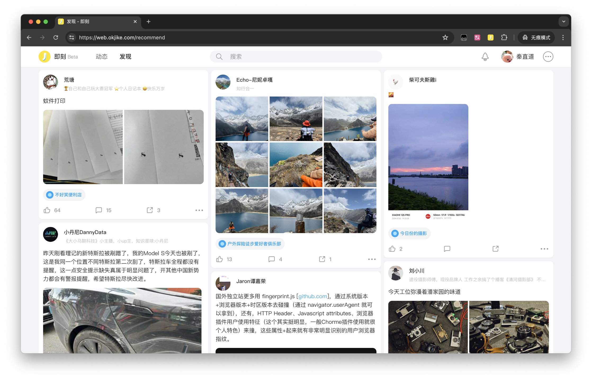
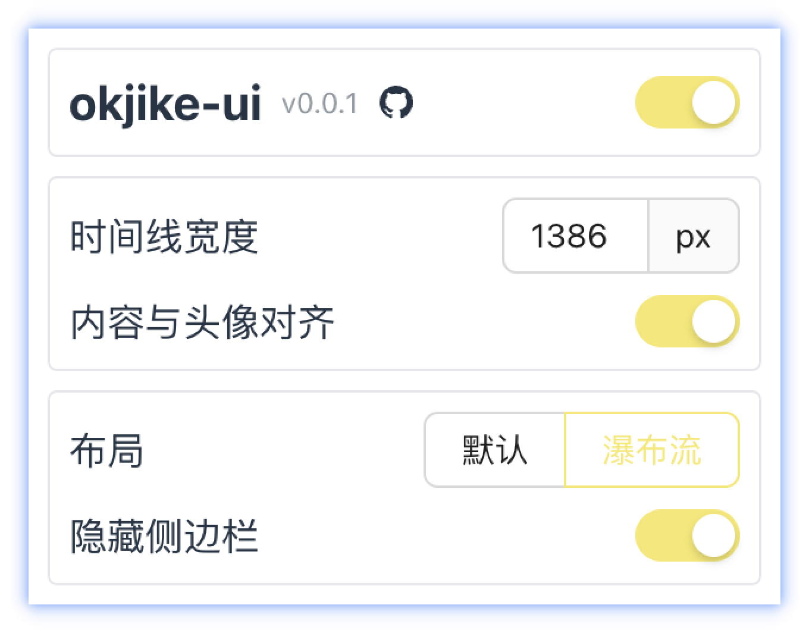

# okjike-ui 🚧

完善即刻网页版的体验。




## 安装

todo

## 开发

本项目使用[Bun](https://bun.sh/)构建。

```bash
bun i
bun run build
# Which browser would you like to build for? [All / Chrome / Firefox] all
#
# dist
# └── chrome
# └── firefox
```

打开浏览器扩展管理，导入对应目录。
