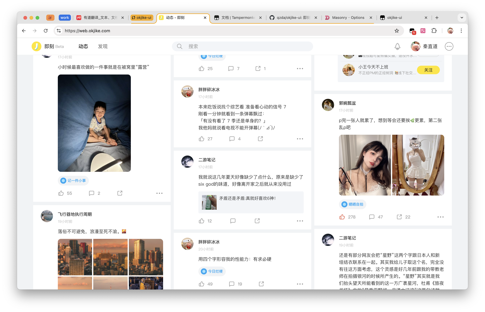

# okjike-ui 🚧

即刻网页版用户脚本。（新版即刻网站开发中...）

## 功能

- 以瀑布流的方式浏览时间线。
- 时间线里展开评论、展开全文改为弹窗的形式。



## 安装

[Github 源](https://raw.githubusercontent.com/qzda/okjike-ui/main/dist/okjike-ui.user.js)

需要浏览器装有 [Tampermonkey](https://www.tampermonkey.net/index.php) 插件。

## 开发

本项目使用 [Bun](https://bun.sh/) 构建。

```bash
bun i
bun dev
# $ NODE_ENV=dev bun run ./build.ts
# 🧹  Cleaned up dist directory.
# 🔥  Built user-script.
# 📦  Bundled     => dist/okjike-ui.user.js
```

将 `dist/okjike-ui.user.js` 文件添加到 Tampermonkey 中。
